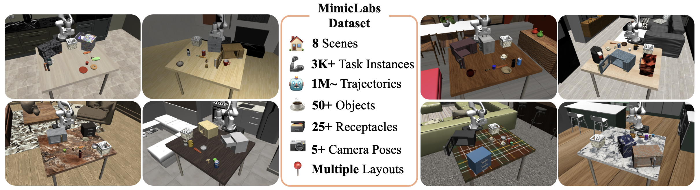

# Welcome to MimicLabs!

Welcome to MimicLabs, your one-stop place for collecting and generating datasets for table-top manipulation! MimicLabs provides a framework for describing a suite of MuJoCo-based tasks, collecting expert demonstrations, and large-scale data generation using MimicGen.

You can use this repository to:
1. build your own tasks for a robot learning study
2. collect expert human teleoperated demonstrations
3. expand your datasets using MimicGen

This is also the official repository for the study paper ''What Matters in Learning from Large-Scale Datasets for Robot Manipulation'' appearing at ICLR 2025.

In this repo, we leverage various open-source projects, including Robosuite, LIBERO, RoboCasa, and MimicGen. We thank their authors for making their code publicly available.


## MimicLabs Dataset



## Citation

If you find this repo useful, please cite in your work:
```bibtex
@inproceedings{
saxena2025mimiclabs,
    title={What Matters in Learning from Large-Scale Datasets for Robot Manipulation},
    author={Vaibhav Saxena, Matthew Bronars, Nadun Ranawaka Arachchige, Kuancheng Wang, Woo Chul Shin, Soroush Nasiriany, Ajay Mandlekar, Danfei Xu},
    booktitle={The Thirteenth International Conference on Learning Representations},
    year={2025},
    url={https://openreview.net/forum?id=LqhorpRLIm}
}
```
